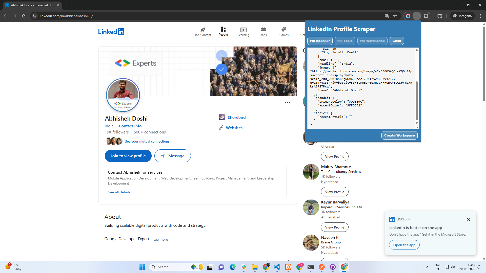

# LinkedIn Profile Scraper - Chrome Extension

A Chrome extension that extracts profile information, company details, and post content from LinkedIn pages and sends the data to an external API for workspace creation.



---

## 📋 Table of Contents

- [Features](#features)
- [Installation](#installation)
- [Usage](#usage)
- [File Structure](#file-structure)
- [How It Works](#how-it-works)
- [API Integration](#api-integration)
- [Privacy & Limitations](#privacy--limitations)

---

## ✨ Features

### Profile Scraping (Speaker)
- ✅ Extract profile name
- ✅ Extract profile photo URL
- ✅ Extract headline/location
- ✅ Extract "About" section
- ✅ Extract services/skills (contentPillars)
- ❌ Email (requires login + connection)

### Company Scraping (Workspace)
- ✅ Extract company name
- ✅ Extract company logo URL

### Post Scraping (Topic)
- ✅ Extract post/article content

### Data Management
- ✅ JSON editor for manual adjustments
- ✅ Local storage persistence
- ✅ Clear data functionality
- ✅ Send data to external API

---

## 📦 Installation

### Prerequisites
- Google Chrome browser (version 88+)
- Basic understanding of Chrome extensions

### Step-by-Step Installation

1. **Download the Extension Files**
   ```
   Clone or download this repository to your local machine
   ```

2. **Verify File Structure**
   ```
   your-extension-folder/
   ├── manifest.json
   ├── README.md
   ├── frontend/
   │   ├── content.js
   │   ├── popup.html
   │   └── popup.js
   └── background/
       └── server.js (optional)
   ```

3. **Load Extension in Chrome**
   - Open Chrome and navigate to `chrome://extensions/`
   - Enable **"Developer mode"** (toggle in top-right corner)
   - Click **"Load unpacked"**
   - Select your extension folder
   - The extension should appear in your extensions list

4. **Pin the Extension (Optional)**
   - Click the puzzle piece icon in Chrome toolbar
   - Find "LinkedIn Profile Scraper"
   - Click the pin icon to keep it visible

5. **Verify Installation**
   - Go to any LinkedIn page
   - Click the extension icon
   - You should see the popup interface

---

## 🚀 Usage

### Scraping a LinkedIn Profile

1. **Navigate to a LinkedIn Profile**
   - Go to `https://www.linkedin.com/in/[username]/`
   - Make sure you're logged into LinkedIn

2. **Open the Extension**
   - Click the extension icon in your toolbar
   - The "Fill Speaker" button should be enabled

3. **Extract Profile Data**
   - Click **"Fill Speaker"**
   - Wait for the alert: "Speaker data filled successfully!"
   - The JSON textarea will populate with profile data

4. **Review and Edit**
   - Check the extracted data in the JSON editor
   - Manually edit any fields if needed
   - Data auto-saves to Chrome storage

### Scraping a Company Page

1. **Navigate to a Company Page**
   - Go to `https://www.linkedin.com/company/[company-name]/`

2. **Open the Extension**
   - Click the extension icon
   - The "Fill Workspace" button should be enabled

3. **Extract Company Data**
   - Click **"Fill Workspace"**
   - Company name and logo will populate

### Scraping a Post

1. **Navigate to a LinkedIn Post**
   - Go to `https://www.linkedin.com/feed/update/[post-id]/`
   - Or `https://www.linkedin.com/posts/[post-id]/`

2. **Open the Extension**
   - Click the extension icon
   - The "Fill Topic" button should be enabled

3. **Extract Post Content**
   - Click **"Fill Topic"**
   - Post text will populate in `topic.recentArticle`

### Sending Data to API

1. **Verify All Data**
   - Make sure all required fields are filled
   - Edit the JSON if needed

2. **Submit to API**
   - Click **"Create Workspace"**
   - Wait for the loading indicator
   - Success alert will confirm submission

3. **Clear Data**
   - Click **"Clear"** to reset all fields
   - Starts fresh for next scraping session

---

## 📁 File Structure

```
linkedin-profile-scraper/
│
├── manifest.json           # Extension configuration
├── README.md              # This file
│
├── frontend/
│   ├── content.js         # Content script (runs on LinkedIn pages)
│   ├── popup.html         # Extension popup UI
│   └── popup.js           # Popup logic and API communication
│
├── background/
│   └── server.js          # Optional Node.js server (not used in extension)
│
└── assets/ (optional)
    ├── logo_text.png      # Extension icon (16x16, 48x48, 128x128)
    └── loading.gif        # Loading animation
```

### Key Files Explained

#### `manifest.json`
Defines extension metadata, permissions, and content script injection rules.

```json
{
  "manifest_version": 3,
  "name": "LinkedIn Profile Scraper",
  "permissions": ["activeTab", "storage", "scripting"],
  "host_permissions": ["https://www.linkedin.com/*"],
  "content_scripts": [...],
  "action": {...}
}
```

#### `frontend/content.js`
Runs on LinkedIn pages. Listens for messages from popup and scrapes DOM elements.

**Key Functions:**
- `FILL_SPEAKER`: Scrapes profile data
- `FILL_WORKSPACE`: Scrapes company data
- `FILL_TOPIC`: Scrapes post data

#### `frontend/popup.js`
Manages the popup UI, handles button clicks, and communicates with content script.

**Key Functions:**
- `executeScriptInPage()`: Sends messages to content script
- `sendData()`: Posts JSON to external API
- `updateJsonOutput()`: Updates textarea with current data

#### `frontend/popup.html`
The extension's user interface.

**UI Elements:**
- Fill Speaker button
- Fill Workspace button
- Fill Topic button
- JSON textarea (editable)
- Clear button
- Create Workspace button

---

## ⚙️ How It Works

### Architecture Overview

```
┌─────────────────┐
│  LinkedIn Page  │
│   (DOM Content) │
└────────┬────────┘
         │
         │ Content Script Injected
         ▼
┌─────────────────┐
│   content.js    │◄──── Scrapes DOM elements
└────────┬────────┘
         │
         │ Message Passing
         ▼
┌─────────────────┐
│    popup.js     │◄──── User clicks buttons
└────────┬────────┘
         │
         │ Displays in UI
         ▼
┌─────────────────┐
│   popup.html    │◄──── User edits JSON
└────────┬────────┘
         │
         │ HTTP POST
         ▼
┌─────────────────┐
│   External API  │◄──── Creates workspace
│ (zync.ai)       │
└─────────────────┘
```

### Data Flow

1. **User navigates to LinkedIn page** (profile, company, or post)
2. **Content script (`content.js`) is injected** into the page
3. **User clicks extension icon** → Popup opens
4. **User clicks "Fill [Type]" button** → Popup sends message to content script
5. **Content script scrapes DOM** → Finds relevant elements using CSS selectors
6. **Content script sends data back** to popup via `sendResponse()`
7. **Popup updates JSON textarea** and saves to Chrome storage
8. **User reviews/edits JSON** (optional)
9. **User clicks "Create Workspace"** → Data sent to `https://app.zync.ai/api/quick-start-workspace`
10. **API response** → Success/error alert shown to user

### Message Passing Example

```javascript
// popup.js sends message
chrome.tabs.sendMessage(tabId, { action: 'FILL_SPEAKER' }, (response) => {
  console.log(response); // { name: "...", imageUrl: "...", ... }
});

// content.js receives message
chrome.runtime.onMessage.addListener((message, sender, sendResponse) => {
  if (message.action === 'FILL_SPEAKER') {
    const data = scrapePage();
    sendResponse(data);
  }
  return true; // Keeps message channel open
});
```

---

## 🌐 API Integration

### Endpoint
```
POST https://app.zync.ai/api/quick-start-workspace
```

### Request Format
```json
{
  "workspace": {
    "workspaceName": "Company Name",
    "logoUrl": "https://..."
  },
  "speaker": {
    "email": "",
    "imageUrl": "https://...",
    "name": "John Doe",
    "headline": "Software Engineer at...",
    "about": "Passionate about...",
    "contentPillars": ["Web Development", "Leadership"]
  },
  "brandKit": {
    "primaryColor": "#00539C",
    "accentColor": "#FFD662"
  },
  "topic": {
    "recentArticle": "Post content here..."
  }
}
```

### Response Format
```json
{
  "result": {
    "user": {
      "id": "...",
      "workspaceId": "..."
    }
  },
  "error": null
}
```

### Error Handling
```javascript
fetch('https://app.zync.ai/api/quick-start-workspace', {
  method: 'POST',
  headers: { 'Content-Type': 'application/json' },
  body: JSON.stringify(data)
})
.then(response => response.json())
.then(data => {
  if (data.error) {
    alert(`Error: ${data.error}`);
  } else {
    alert('Success!');
  }
})
.catch(error => {
  console.error('API Error:', error);
  alert('Failed to send data');
});
```

---

## 🔒 Privacy & Limitations

### What This Extension Does
- ✅ Scrapes publicly visible LinkedIn profile information
- ✅ Stores data locally in Chrome storage
- ✅ Sends data to external API when user clicks "Create Workspace"

### What This Extension Does NOT Do
- ❌ Access private/hidden information
- ❌ Scrape without user action
- ❌ Store data on external servers (except when user submits)
- ❌ Track user activity
- ❌ Access email addresses (not publicly available)

### Limitations
1. **Public Profiles Only**: Only works on profiles you can view while logged in
2. **Email Not Available**: Cannot scrape email addresses
3. **Rate Limiting**: Excessive scraping may trigger LinkedIn's rate limits
4. **HTML Changes**: LinkedIn frequently updates their HTML structure, breaking selectors
5. **Login Required**: Must be logged into LinkedIn for extension to work

### LinkedIn Terms of Service
**Important:** Web scraping may violate LinkedIn's Terms of Service. Use this extension responsibly and only for personal, non-commercial purposes. Excessive or automated scraping may result in account restrictions.

---

**Made with ❤️ for productivity**